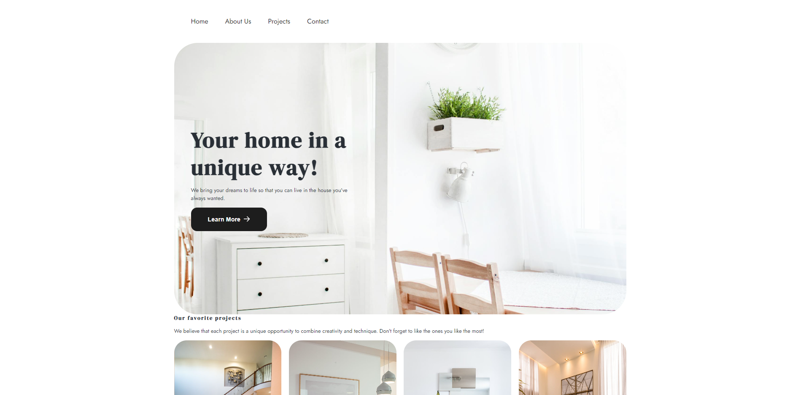
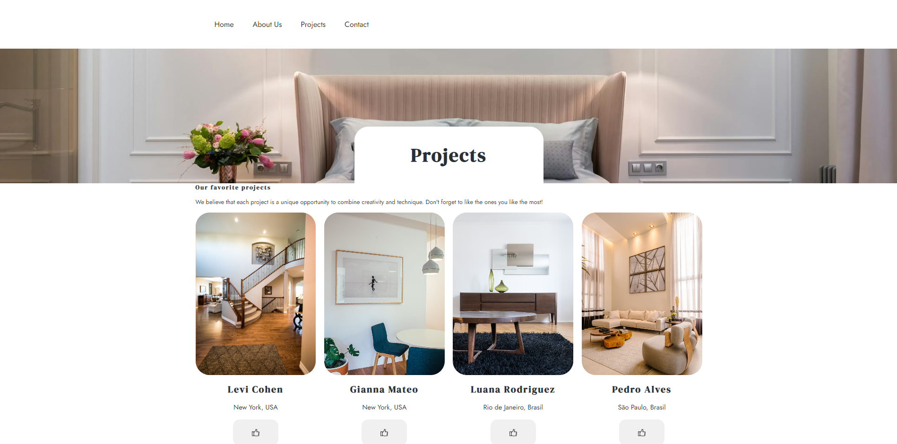
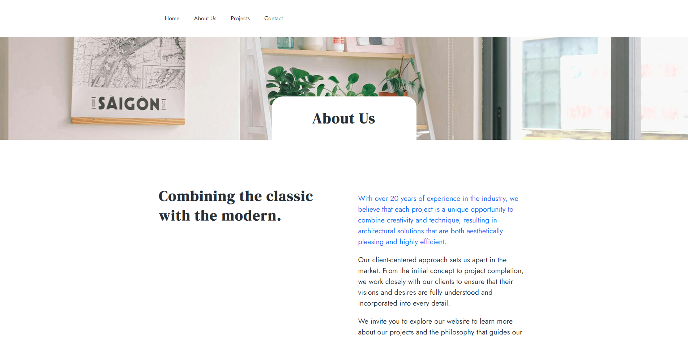
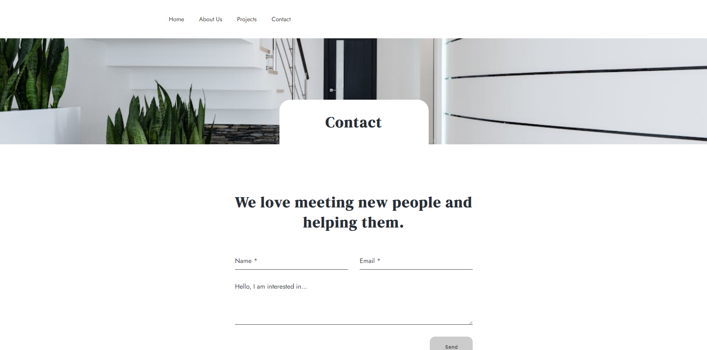

<h1 align="center">Página de Arquitetura</h1>

Bem-vindo ao repositório da Página de Arquitetura! Este projeto é uma landing page desenvolvida para exibir informações sobre um escritório de arquitetura. O design foca na apresentação dos serviços oferecidos, projetos anteriores e uma interface amigável.

<h2>📋 Funcionalidades</h2>

<ul>
<li>Exibição dos principais projetos do escritório de arquitetura</li>
<li>Seção de serviços oferecido</li>
<li>Formulário de contato para clientes interessados</li>
<li>Design responsivo para todos os dispositivos</li>
</ul>

<h2>🛠️ Tecnologias Utilizadas</h2>

<ul>
<li><b>HTML5:</b> Estruturação do conteúdo da página.</li>
<li><b>CSS3:</b> Estilização da página, com uso de técnicas de design responsivo.</li>
<li><b>JavaScript:</b> Interatividade na navegação e funcionalidade do formulário.</li>
<li><b>React</b> Biblioteca JavaScript utilizada para criar a interface dinâmica.</li>
<li><b>Vercel</b> Hospedagem do projeto.</li>
</ul>

<h4><b>Link:</b><a> https://paagina-arquitetura.vercel.app/</a></h4>

<h2> 📸 Capturas de Tela

<h3> Página Inicial

<h3> Projetos

<h3> Sobre Nós

<h3>📞 Contato

<h2> Contato</h2>

Se tiver alguma dúvida ou sugestão, entre em contato através de:

<li><b>Email:</b><a> viniciusalberico@outlook.com</a></li>
 
<li><b>Linkedin:</b><a>https://www.linkedin.com/in/vinicius-cirilo-1b12a5191/</a></li>